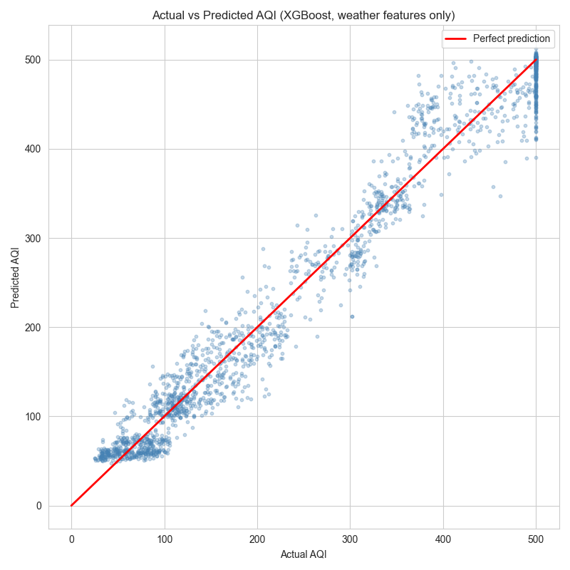
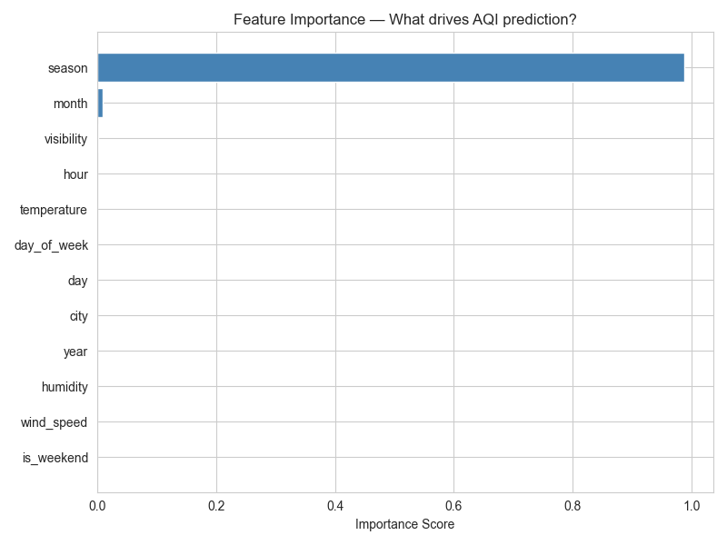

# Delhi NCR Air Quality Index (AQI) Prediction

🚀 **Live Demo:** [delhi-ncr-aqi.streamlit.app](https://delhi-ncr-aqi.streamlit.app)

A machine learning project to predict Air Quality Index in the Delhi NCR 
region using weather and temporal features. Built as a hands-on learning 
project covering the full ML pipeline — EDA, preprocessing, model training, 
and evaluation.

---

## 📊 Dataset
- **Source:** Delhi NCR hourly air quality data (2020–2025)
- **Size:** 201,664 rows × 25 features
- **Cities:** Delhi, Noida, Gurugram, Faridabad, Ghaziabad
- **Target:** AQI value (regression) and AQI category (classification)

---

## 🔍 Project Structure
AQI_PREDICTION/

├── data/

│   └── delhi_ncr_aqi_dataset.csv

├── notebooks/

│   ├── 01_eda.ipynb

│   ├── 02_preprocessing.ipynb

│   ├── 03_models.ipynb

│   └── 04_evaluation.ipynb

├── models/
│   ├── best_model_xgboost.pkl
│   ├── random_forest.pkl
│   ├── scaler.pkl
│   └── xgboost_model.pkl

├── outputs/

│   ├── actual_vs_predicted.png

│   ├── feature_importance.png

│   └── error_distribution.png

├── src/

│   ├── predict.py

│   └── train.py

├── .gitignore

├── requirements.txt

└── README.md

---

## ⚙️ ML Pipeline

### Experiment 1 — Full Features (18 columns)
Using all pollutant + weather features to predict AQI.
Near-perfect scores because pollutants are mathematically 
used to derive AQI. Identified this as data leakage and 
moved to Experiment 2.

### Experiment 2 — Weather Only (12 columns)
Predicting AQI from weather and time features only —
a genuinely challenging and real-world useful problem
(predict tomorrow's AQI before sensor readings are available).

| Model | Test R² | Test MAE |
|-------|---------|----------|
| Linear Regression | 0.9233 | 37.66 |
| Decision Tree | 0.9480 | 26.24 |
| Random Forest | 0.9724 | 20.32 |
| **XGBoost** | **0.9740** | **20.05** |

**Winner: XGBoost** — best R² and lowest error with minimal overfitting.

---

## 📈 Key Results




---

## 💡 Key Insights
- **Season is the strongest predictor** — Delhi winters have 
  dramatically worse AQI than monsoon months
- **Decision Tree overfits** — perfect training score (1.0) but 
  drops on test data, confirming memorisation
- **Model limitation** — underpredicts extreme AQI (400–500) 
  because sudden spikes from events like Diwali or crop burning 
  aren't captured by weather features alone

---

## 🛠️ How to Run
```bash
# Install dependencies
pip install -r requirements.txt

# Run notebooks in order
notebooks/01_eda.ipynb
notebooks/02_preprocessing.ipynb
notebooks/03_models.ipynb
notebooks/04_evaluation.ipynb
```

---

## 📦 Requirements

pandas

numpy

matplotlib

seaborn

scikit-learn

xgboost

joblib

---

## 👤 Author
**Shaurya Sati**  
GitHub: [@Shaurya-Sati](https://github.com/Shaurya-Sati)